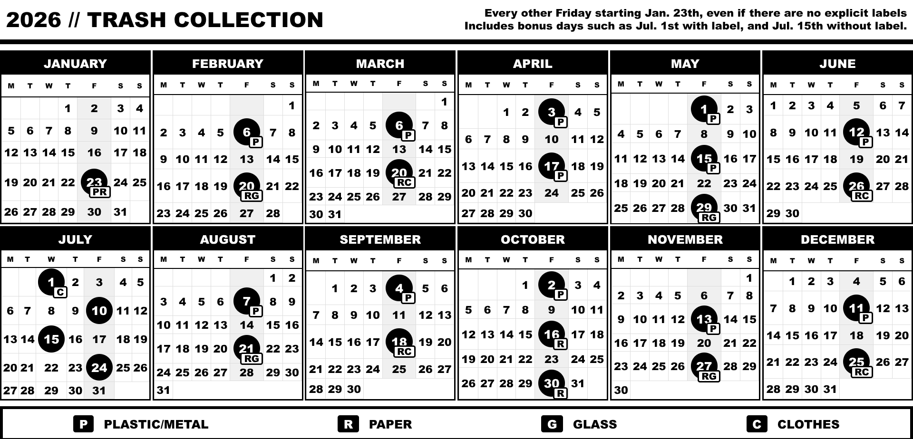

# Trash Collection Calendar

A customizable HTML calendar for displaying biweekly (or any recurring) schedules with configurable dates and labels. Its initial purpose is to track trash collection schedules.



## Features

- Displays a full-year calendar (January to December)
- Highlights the column for recurring special days (e.g., biweekly household collections)
- Circles all special or recurring collection days starting from a configurable date
- Customizable labels for special collections (e.g., M: Plastic/Metal, P: Paper, G: Glass, T: Textile); supports multiple labels per day
- Supports bonus days (circled without labels)
- Optimized for landscape printing
- Uses big, distinct labels, making it optimal for black-and-white printing and accessible for older people.

## Configuration

Edit `config.js` (or `example-config.js`) to customize:

- `startDateStr`: Starting date for recurring collections (format: "YYYY-MM-DD")
- `schedule`: Array of objects for special collection days, each with `month` (0-11), `day`, and `types` (array of codes, or empty for bonus days)
- `months`: Array of month names
- `daysShort`: Array of day abbreviations (Monday to Sunday)
- `title`: Page title
- `headerH1`: Main header text
- `headerInfo`: Additional header information (supports HTML)
- `legend`: Array of objects with `code` and `text` for waste types

The calendar automatically calculates recurring dates from the start date. You can change the recurrence interval by adjusting the divisor in the code (default is 14 days for biweekly):

```javascript
if (daysIndex % 14 === 0) { // Is today a recurring day (did 14 days pass since the last scheduled day)?
```

Most important configuration entries are:

```javascript
const startDateStr = "2026-01-23";
const schedule = [
  { month: 1, day: 6, types: ["P", "R"] }, // Multiple labels for combined collection
  { month: 6, day: 15, types: [] }, // Bonus day with no label
];
```

## Usage

1. Customize `config.js` (or rename `example-config.js` to `config.js`)
2. Open `cal.html` in a web browser
3. For printing: Use landscape orientation and print preview
